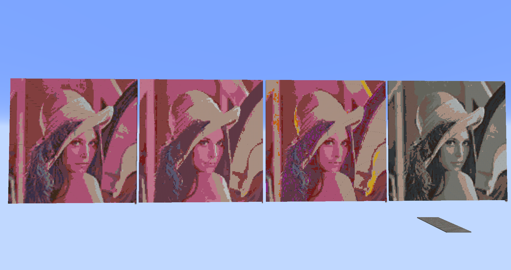
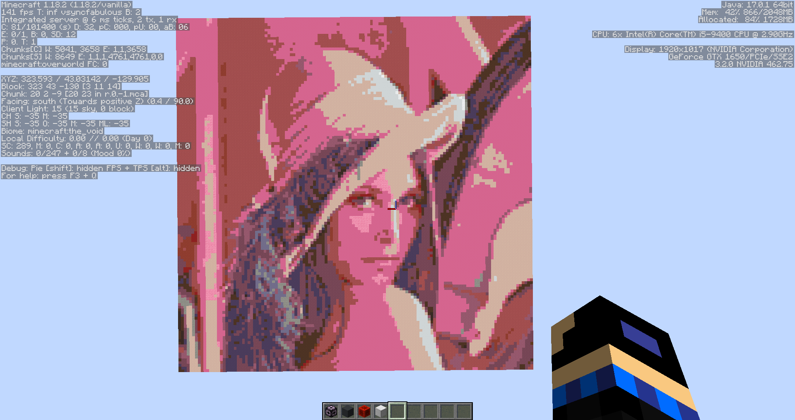

# MCPixelArtMaker
A simple Minecraft 16 color pixel art maker. 

一个简易的Minecraft16色像素画生成器。

这是一个简易的Minecraft16色像素画生成器，可以将图片转换为MC中结构方块所使用的nbt结构文件。

所生成的方块可以使用MC中的16色羊毛\(wool\)、16色混凝土\(concrete\)、16色陶瓦\(terracotta\)中的任意1至3种进行生成。

生成的像素画可以使用RGB色彩，也可使用HSV、HSL与灰度色彩。


上图便是同一张图在128*128结构大小情况下四种色彩模式的对比（方块使用的是全部）。从左往右分别是: RGB, HSV, HSL, L。

这个生成器用到了这个[NBT](https://github.com/twoolie/NBT)模块。

程序使用Python3.9编写。

## 简易使用方法说明
可以直接点右边的release，里面有打包好的.exe文件，只要双击直接打开就行了。不过还是建议看一下下面的说明，这对你们使用这个.exe文件也有好处。

将文件PixelArtMaker下载下来后放到所需要的路径下。然后将这个文件作为模块导入python文件中就可以使用了。以下是最为简要的使用说明：
```
from PixelArtMaker import Maker         # 这个生成器最主要的就是这个Maker类
maker = Maker()
maker.set_path(r"D:\xxx\yyy")           # 设置文件输入路径，请确保这个路径存在且里面有需要转换成nbt文件的像素画
maker.set_path(r"D:\xxx\yyy\zzz", "out")    # 设置文件的输出路径，如果不设置的话，则默认输出路径为输入路径里的\file_out，在这个例子中为D:\xxx\yyy\file_out
maker.set_size((96, 96))                # 设置输出结构的大小，长宽比最好与图片的长宽比相同
maker.set_using_blocks('concrete')      # 设置所要使用的方块，可以输入列表，也可输入'all'表示全部，如果不设置的话则默认使用羊毛
maker.set_color_space("L")              # 设置颜色模式，如果不设置的话默认使用RGB
maker.set_direction('ud')               # 设置像素画的方向，'ud'表示从上至下，也可设置'ns'表示由北至南，默认使用'ns'
# 必须设置的参数为输入路径与结构大小，其余都有默认值，不设置也没事，还有些其他的参数可以设置，在接下去的方法说明中再详细说明吧
maker.transformation('lenna.png')       # 将文件D:\xxx\yyy\lenna.png转换为nbt结构文件并保存至D:\xxx\yyy\zzz
```
以上就是一次简单的使用方式。

也可以在不改变文件相对路径的情况下直接运行pixelartmaker.py 其结果与打开exe是没有区别的。

```
>> -------MCPixelArtMaker Vx.x.x-------@Dedicatus1979-------感谢@御坂10703的耐心指导-------
   更多使用方式可以可前往'https://github.com/Dedicatu1979/MCPixelArtMaker'中了解更多。
   ------以下是一些全局设置：------
   请输入需要转换的图片所在的文件夹的路径。(仅需要输入文件夹的路径即可，跳过则以当前文件所在文件夹的路径作为输入)
<<
>> 当前使用默认路径。
   --*--*--#--*--*--
   请输入转换后的文件保存的文件夹的路径。(仅需要输入文件夹的路径即可，跳过则文件保存至输入文件夹所在的路径下的\file_out)
<<
>> 当前使用默认路径。
   --*--*--#--*--*--
   请输入结构所使用的方块，限在['wool', 'concrete', 'terracotta']中任选1-3个。默认使用wool.
   如需多选请使用("圆括号","加引号")或["中括号","加引号"](元组或列表的形式)输入。
   例如直接输入wool或输入["wool", "concrete"]，全部使用的话也可直接输入all。
<< all
>> 您当前输入的方块为:all
   --*--*--#--*--*--
   是否还有其他需要设置的，如有需要设置的话请以{'大括号': '冒号引号','的方式': '继续进行设置'}(字典形式)输入：
   ['version', 'direction', 'color_space', 'batch'] 以上是允许继续设置的参数，如不需要的话可以直接跳过。
<<
>> --*--*--*--*--*--*--*--
   请输入所需要的结构的大小，格式为元组或列表的形式，例如(96, 72).
<< (128, 128)
>> 您所设置的结构大小为(128, 128)
   --*--*--#--*--*--
   请输入需要转换的图片名称。(仅需要输入文件名即可，例如lenna.png).
<< lenna.png
>> 您所设置的文件为lenna.png
   --*--*--#--*--*--
   少女祈祷中...: 100%|███████████████████████████████████████████| 128/128 [00:00<00:00, 354.87it/s, Now file=1, Total=1]
   
   运行已结束，请问还需要继续转换结构吗？输入任意值继续，输入q退出。
<< q
>> 请按任意键继续. . .

```
以上便是使用.exe或使用pixelartmaker.py的运行样式。

## 主要函数/方法功能的简易说明
|函数               |函数说明|
|----------         |---------|
|Maker.get_allow_blocks() -> list            |用于获取可以用来设置的方块|
|Maker.get_allow_color_space() -> list       |用于获取可以用来设置的色彩空间|
|Maker.get_allow_settings() -> list          |用于获取可以外部设置/使用setting()设置的参数|
|Maker.get_size() -> [list, tuple, None]     |用于获取设置的结构大小|
|Maker.reset_batch()                         |用于将批量模式标记复位，即关闭批量模式|
|Maker.reset_file_cache()                    |用于清空文件缓存列表|
|Maker.set_batch(status: [bool, str] = True) |用于设置批量模式标记，默认是设置为开启|
|Maker.set_color_space(color_space: str)     |用于设置转换的图片使用的色彩空间|
|Maker.set_direction(direction: str)         |用于设置转换后的结构的方向|
|Maker.set_path(path: [str, Path], path_type: str = "in")   |用于设置文件输入输出的路径，默认是设置输入路径|
|Maker.set_size(struct_size: [tuple[int, int], list[int, int])    |用于设置输出的结构大小|
|Maker.set_transformation_file(trans_file_name: str)        |用于设置需要转换的文件名|
|Maker.set_using_blocks(using_blocks: [str, list, tuple])   |用于设置结构所使用的方块|
|Maker.set_version(version: [float, str])    |用于设置结构的游戏版本|
|Maker.settings(setting_dict: dict)          |用于一次性设置多个需要设置的值|
|Maker.transformation(import_file: str = None)              |用于转换文件用的主函数|

需要详细了解原理之类的，可以直接看代码中的文档。
### 部分函数的详细说明
```
maker.set_path(r"D:\xxxxxx")
maker.set_size([128, 128])
maker.transformation()

>> 
```
Maker.set_path() **必须进行设置**，若不进行设置则会抛出错误。
```
maker.set_size([128, 128])
maker.transformation()

>>  OSError: 未指定输入文件路径。
```
Maker.set_size() 也**必须进行设置**，若不进行设置则会抛出错误。
```
maker.set_path(r"D:\xxxxxx")
maker.transformation()

>> ValueError: 未设置结构大小，或设置的内容不是list或tuple类型。
```
* * * * * *
```
maker.set_path(r"D:\xxxx")
maker.set_size([128, 128])
maker.transformation(r"yyy.png")             # 推荐使用方法
# maker.transformation(r"D:\xxxx\yyy.png")   # 不建议使用
# maker.transformation(r"D:\vvvv\yyy.png")   # 非常不建议

>> 少女祈祷中...: 100%|██████████| 128/128 [00:00<00:00, 319.99it/s, Now file=1, Total=1]
```
Maker.transformation() 内可以写绝对路径，也可以写只写文件名，但为了防止出现找不到输出文件之类的问题，这里建议使用**只写文件名**。
如果输入的绝对路径不在设置路径下且没有设置输出路径，则**输出文件依旧是在设置路径下，而不是输入的绝对路径下**。
********
```
maker.set_path(r"D:\xxxx")
maker.set_size([128, 128])
maker.set_transformation_file('yyyy.png')    # 不是很推荐这么使用
maker.transformation()

>> 少女祈祷中...: 100%|██████████| 128/128 [00:00<00:00, 319.99it/s, Now file=1, Total=1]
```
```
maker.set_path(r"D:\xxxx")
maker.set_size([128, 128])
maker.transformation('yyyy.png')    # 推荐使用方法

>> 少女祈祷中...: 100%|██████████| 128/128 [00:00<00:00, 319.99it/s, Now file=1, Total=1]
```
以上两串代码执行的是相同的操作。若仅仅只是转换一张图片，这里**建议使用第二种生成方法**。
```
maker.set_path(r"D:\xxxx")
maker.set_size([128, 128])
maker.set_transformation_file('yyyy.png')
maker.set_transformation_file('zzzz.png')
maker.transformation('yyyy.png')

>> 少女祈祷中...: 100%|██████████| 128/128 [00:00<00:00, 340.77it/s, Now file=1, Total=3]
>> 少女祈祷中...: 100%|██████████| 128/128 [00:00<00:00, 292.48it/s, Now file=2, Total=3]
>> 少女祈祷中...: 100%|██████████| 128/128 [00:00<00:00, 283.52it/s, Now file=3, Total=3]
```
如果Maker.transformation()与Maker.set_transformation_file()同时使用或多次使用Maker.set_transformation_file()，那就是手动设置多张图片了。
在这个例子中第3行于第5行输入的文件是相同的，所以输出时也会输出**两份同样的文件**，一份名为yyyy.nbt，一份为yyyy_1.nbt。
```
maker.set_path(r"D:\xxxx")
maker.set_size([128, 128])
maker.set_batch()
maker.transformation()

>> 少女祈祷中...: 100%|██████████| 128/128 [00:00<00:00, 340.77it/s, Now file=1, Total=3]
>> 少女祈祷中...: 100%|██████████| 128/128 [00:00<00:00, 292.48it/s, Now file=2, Total=3]
>> 少女祈祷中...: 100%|██████████| 128/128 [00:00<00:00, 283.52it/s, Now file=3, Total=3]
```
需要批量转换时，还是推荐使用Maker.set_batch()，这会使程序将设置的路径中的所有图片通通进行转换，但转换的样式是相同的，比如这里设置的结构大小为[128,128]，那输出的所有结构都是这个大小。
********
```
maker.set_path(r"D:\xxxx")
maker.set_size([128, 128])
maker.set_using_blocks('all')
maker.set_direction('ud')
maker.transformation(r"yyy.png") 

>> 少女祈祷中...: 100%|██████████| 128/128 [00:00<00:00, 312.18it/s, Now file=1, Total=1]
```

Maker.set_direction()用于设置结构方向，Maker.set_color_space()用于设置使用方块，上图便是这串代码的演示。(可以注意一下图片中的中心指针)
*****************
```
print(maker.get_allow_settings())

>> ['version', 'direction', 'color_space', 'batch']
```
以上输出的四个关键词是**允许直接赋值**的成员变量，或者也可通过Maker.settings()进行赋值。
```
maker.version = 1.12
maker.direction = "ns"     # 该变量默认值也是"ns"
setting = {"batch": True,
           "color_space": "hsv"}
maker.settings(setting)
print(maker.version, maker.direction, maker.color_space, maker.batch)

>> 1.12 ns HSV True
```
以上就是个对这些变量进行设置的例子
```
maker.settings(batch = True)

>> TypeError: settings() got an unexpected keyword argument 'batch'
```
很显然的，Maker.settings()只能接受字典形式的输入。
```
maker.settings({"batch": True,
               "color_space": "hsv",
               "size": (128,128)})

>> NameError: 参数'size'无法被设置，可能是因为不存在，也可能是不允许设置这个参数。
```
Maker.settings()**不允许设置**Maker.get_allow_settings()之外的成员变量或不存在的变量。

## 最后
感谢 [yuban10703](https://github.com/yuban10703) 在本人遇到问题的时候的耐心指导。